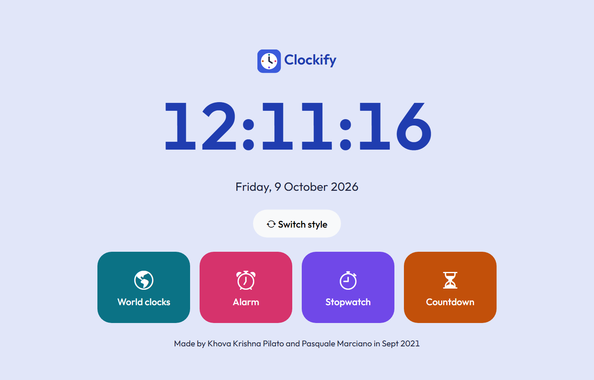
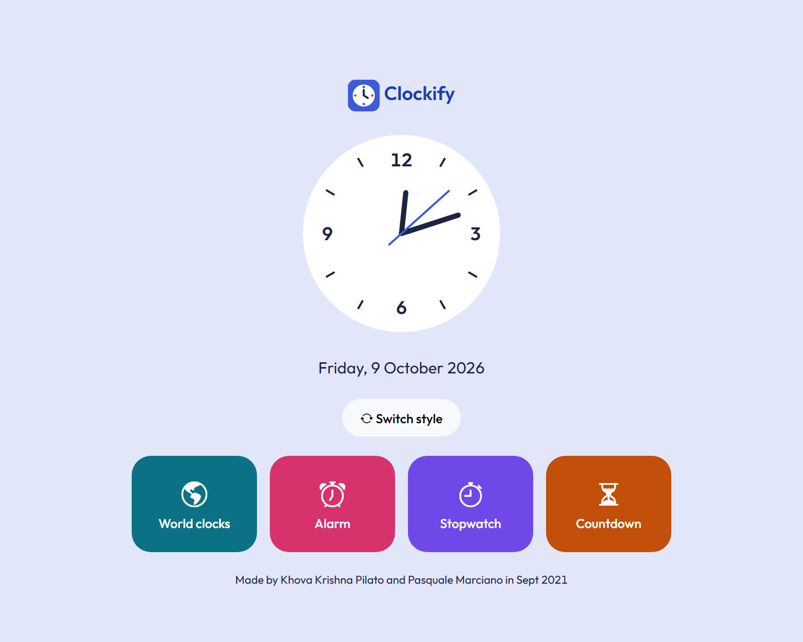
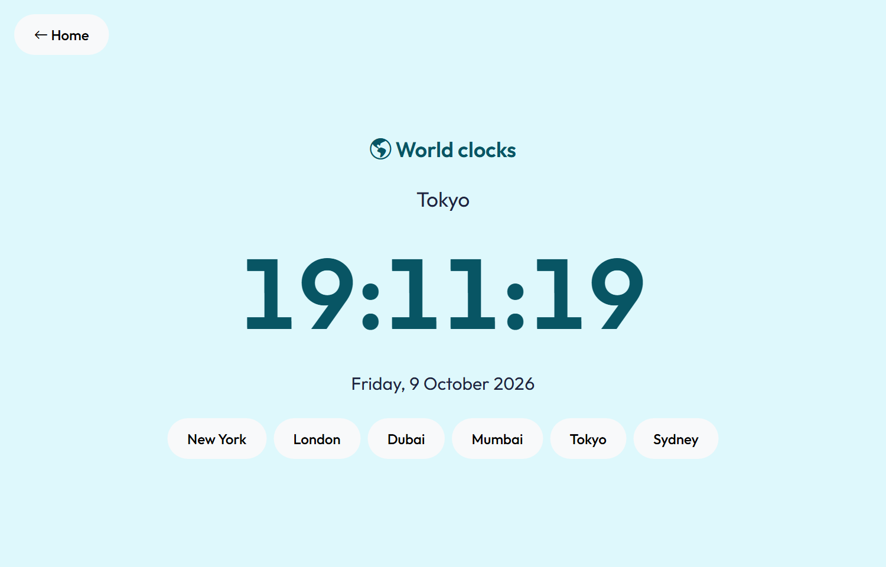
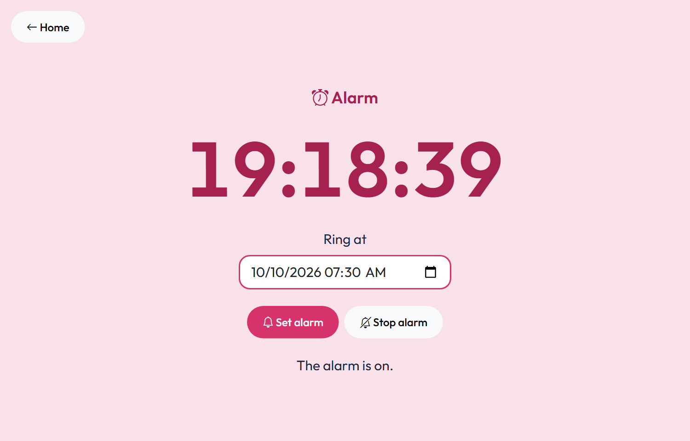
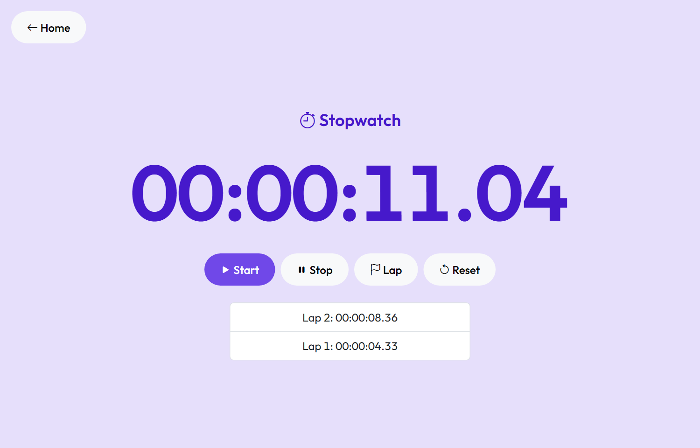
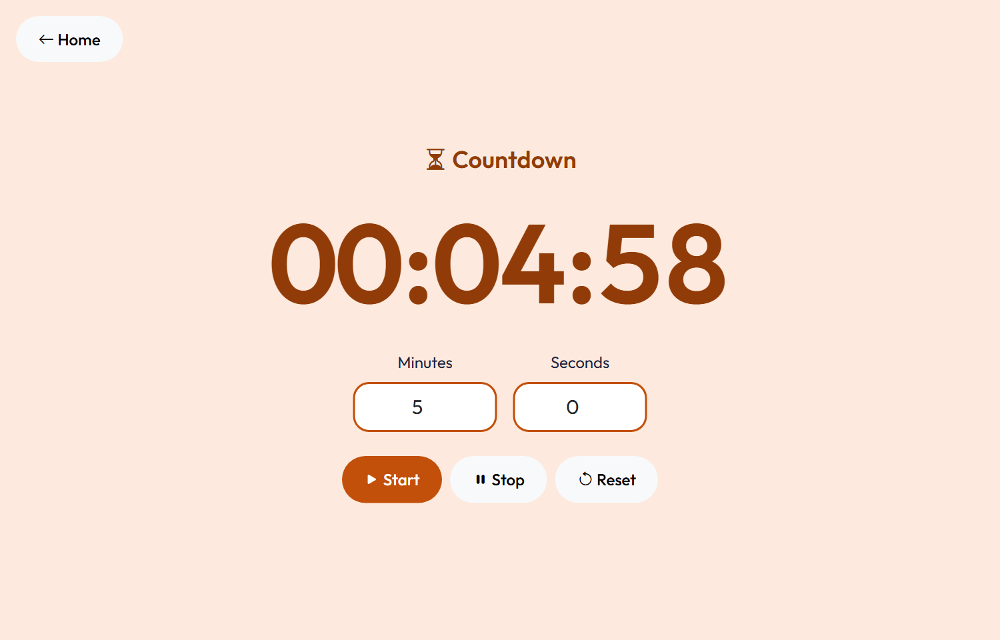
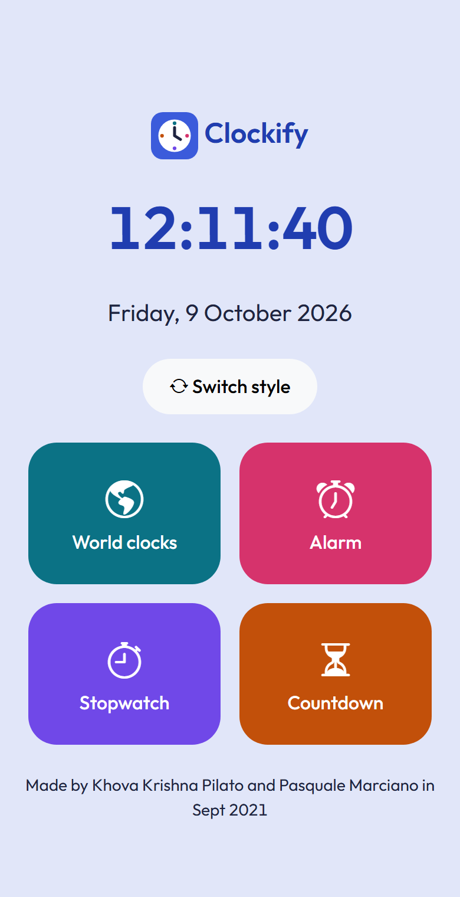

# Clockify

Clockify is a simple clock app with world clocks, an alarm, a stopwatch and a countdown.

**Live preview: [krishnapilato.github.io/clockify](https://krishnapilato.github.io/clockify/)**



This project is part of our internship experience. We were a team of two and we made the first version in two days. We keep improving it step by step.

Made by Khova Krishna Pilato and Pasquale Marciano in Sept 2021. Keeping project updated.

---

## Technologies Used

- **HTML5**
- **SCSS** (compiled to CSS)
- **JavaScript**
- **Bootstrap 5.3.8**
- **Bootstrap Icons**

---

## Features Overview

### 1. Homepage (`index.html`)

The homepage shows the current time and date. The **Switch style** button changes the clock from digital to analog. The analog clock is an SVG. The four colored tiles open the other pages.



### 2. World Clocks (`clocks.html`)

Pick a city to see its time and date: New York, London, Dubai, Mumbai, Tokyo or Sydney.



### 3. Alarm (`alarm.html`)

- Set a future date and time.
- See how much time is left in **hours, minutes and seconds**.
- Stop the alarm if you change your mind.

When the time comes the alarm plays a sound and the clock is highlighted until you stop it. Keep the page open, the alarm only works while the page is open.



### 4. Stopwatch (`stopwatch.html`)

Start, stop and reset the timer. It shows **hours, minutes, seconds and hundredths**. The **Lap** button saves the current time in a list.



### 5. Countdown (`countdown.html`)

Write the minutes and seconds or use the default **2 minutes**. You can start, stop and reset. A sound plays when the time is up.



### Works on the phone too



---

## Files

| File | What is inside |
| --- | --- |
| `index.html`, `clocks.html`, `alarm.html`, `stopwatch.html`, `countdown.html` | One HTML file for every page |
| `style.scss` | The style of all the pages (colors, buttons, clock) |
| `style.css` | The CSS made from `style.scss`, this is the file the pages load |
| `script.js` | The JavaScript of all the pages, with the functions they share |
| `icon.svg` | The app icon |
| `alarm.mp3` | The alarm sound |
| `screenshots/` | The images of this README |

---

## How to Run It

Open `index.html` in the browser. There is nothing to install.

If you change `style.scss` you have to build the CSS again:

```bash
npx sass --no-source-map style.scss style.css
```

---

## Accessibility

- Every page works with the keyboard and the focus is always visible.
- The colors have enough contrast for the text.
- Screen readers get the messages of the alarm and the countdown.
- There are no flashing animations.

---

## Planned Improvements

- Keep the alarm after the page is closed.
- Let the user add more cities.
- Choose the alarm sound.

---

## Contact Us

We welcome feedback, suggestions and ideas!
